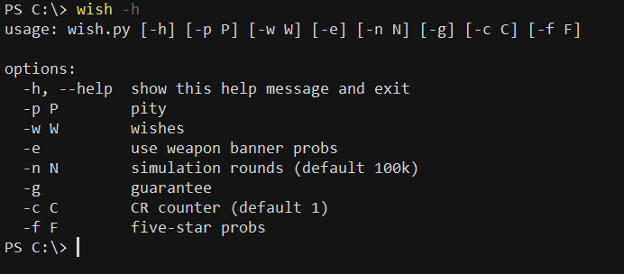
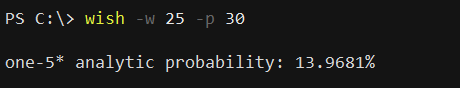
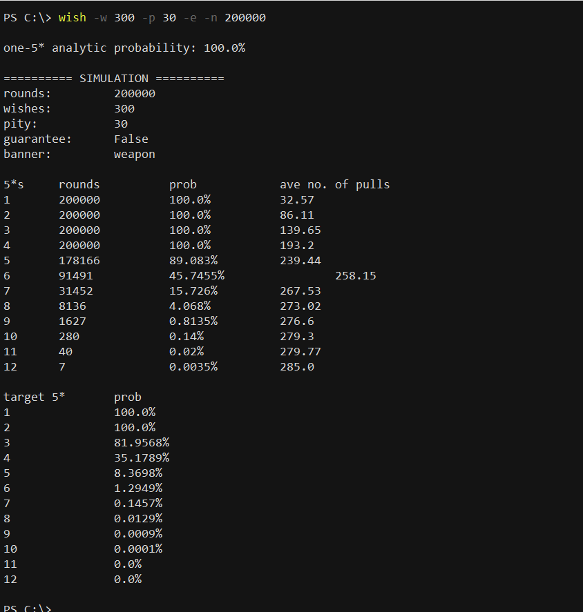
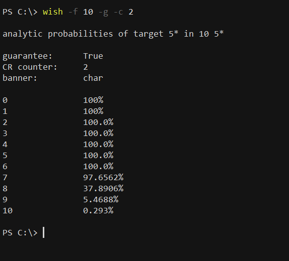

# wishes

A wish calculator for Genshin. Main functions: 
* analytic calculations of probabilities for the next 5*
* analytic calculations of probabilities for target 5*s
* wishing simulations 
* all the above accounts for capturing radience and weapon banners

To run on the command-line, use wish.py--usage described below. The calculator has also been implemented as a [flask app](https://ricardoshillyshally.pythonanywhere.com/), with source code in app.py.

### assumptions
1. **5\* character probabilities**. 0.6% at pity<74, +5.84705882% for each pity after 73. [reference](https://genshin-impact.fandom.com/f/p/4400000000000308779).
2. **target char probabilities**. 50% on non-guaranteed 5*; CR prob=0% for CR<2, 50% for CR=2, 100% otherwise. [reference](https://www.reddit.com/r/Genshin_Impact/comments/1f3ykny/capturing_radiance_details_observations_and/)
3. **5\* weapon probabilities**. 0.7% at pity<63, +5.51666667% for each pity after 62. [reference](https://library.keqingmains.com/general-mechanics/gacha#featured-weapon-banner)
4. **target weapon probabilities**. 37.5% on non-guaranteed 5*; no CR. [reference](https://genshin-impact.fandom.com/wiki/Wish)

### usage
Run `wish.py -h` to see options.

Pass the value of a number of wishes to `-w`. With default values, the script calculates the analytic probability of the next 5\* character from 0 pity and runs a 100000 round simulation, assuming no guarantee and a CR counter of 1. The number of 5\*s in the simulation is reported, and analytic values are used to estimate the number of target 5\*s. Use the options to overwrite defaults.

Example: To calculate the analytic probability of one 5* in 25 pulls from 20 pity, run `wish.py -w 25 -p 20`.

Example: To run a 200000 round simulation of 300 pulls from 30 pity on the weapon banner, run `wish.py -w 300 -p 30 -e -n 200000`.

To calculate analytic probabilities of target 5\*s from a given number of 5\*s, use the `-f` option. Example: To calculate the probabilities for 10 5*s on the char banner with CR counter 2 and guarantee, run `wish.py -f 10 -g -c 2`

